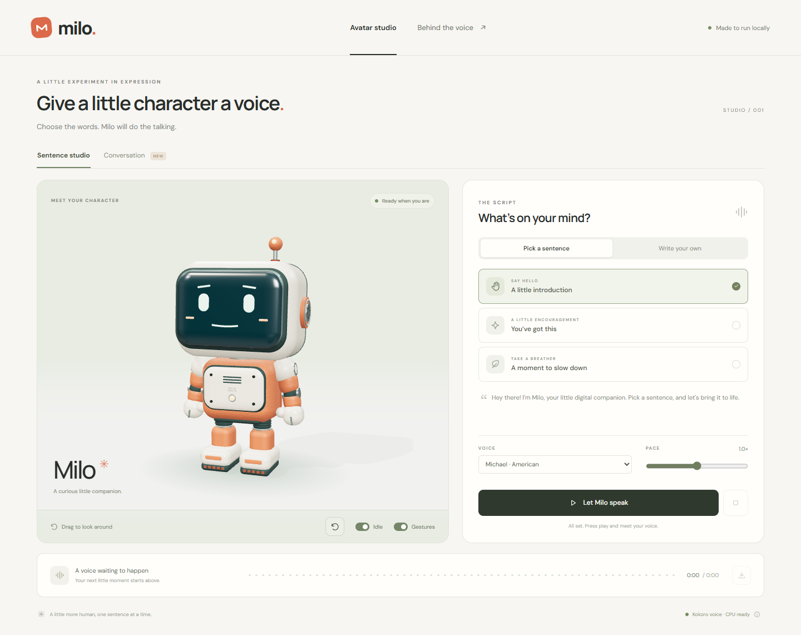
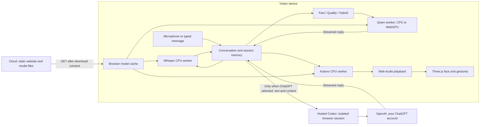

# Milo — a voice companion in 3D

Milo is an expressive Three.js robot that speaks your sentences and has voice or typed conversations. **On-device processing is the default.** Its cloud service delivers the website and downloadable model files. An optional **ChatGPT · My account** provider connects through Milo's hosted Codex app-server using OpenAI's device-code sign-in. Voice recordings and speech processing remain on your device; messages and conversation context pass through Milo to OpenAI only when you select that provider. There is no automatic switch to a cloud provider.

**Website:** [milo.seemplifyai.com](https://milo.seemplifyai.com) · **Source:** [michaelegbo/milo](https://github.com/michaelegbo/milo) · **License:** [PolyForm Noncommercial 1.0.0](LICENSE)



[Watch the 38-second demo](https://github.com/michaelegbo/milo/releases/download/v1.0.0/milo-launch-demo.webm) — captured from the live website with real Kokoro speech and avatar animation. [Release and downloads](https://github.com/michaelegbo/milo/releases/tag/v1.0.0).

## Try Milo

1. Open the website in a recent desktop browser. The avatar appears before any model download.
2. Choose **Download voice** to enable the sentence studio, or the conversation download option for voice and replies. Milo explains the download size before starting.
3. Pick a preset or type a sentence, choose Michael, Heart or Emma, and let Milo speak. Use pause, resume, stop or download the generated WAV.
4. Open **Conversation** and type a message. Microphone permission is requested only when you choose to listen or enable microphone selection.
5. Select Fast, Better answers or Hybrid. Prepare the corresponding model when prompted.
6. If the browser detects a compatible GPU, enable acceleration for replies. Turn it off to reload the selected model on the device CPU. Unload the engines to release their live contexts.

Initial preparation can take minutes and conversation downloads are large. Start with voice or Fast on a laptop; CPU replies can take tens of seconds. This is an experimental local AI companion, with no browsing or external tools.

If the microphone menu shows only **System default**, choose **Allow microphone access** beneath it. Browsers may hide device names until you grant permission. Milo briefly opens and immediately releases a microphone stream to reveal the list; this action does not record or upload audio. Then choose your input. **Refresh microphones** rescans connected devices without opening another stream. If permission is blocked, allow the microphone in the browser's site settings and retry.

## What makes Milo feel alive

- A procedural robot with ceramic grain, textured orange coating, rubber joints, brushed metal, a polished face lens and studio lighting.
- Mouth movement driven by the generated audio waveform; hand gestures, elbow bends, wrist turns, nods and body leans follow audible speech.
- Listening, thinking and speaking expressions, with eye, brow, cheek, chest and antenna lighting cues.
- Interruptible playback, streamed replies, sentence-by-sentence speech and optional hands-free turn taking.
- Three voices, adjustable pace, camera controls, independent idle/gesture switches and reduced-motion support.
- Session memory for explicit details and earlier conversation, shared across Fast, Better answers and Hybrid within the tab.

The mouth shapes approximate audio energy and frequency bands; they are not phoneme-accurate lip sync. Delivery cues use simple rules applied to Milo's outgoing words, not emotion recognition of the person speaking.

## Use your ChatGPT account

Open **Conversation → Reply provider → ChatGPT · My account → Connect ChatGPT**. Copy the one-time code, choose **Open OpenAI**, and complete sign-in on OpenAI's page. Milo automatically checks for completion. No terminal, pairing code or software installation is needed on your computer or phone. Milo never asks for your ChatGPT password or copies the Codex desktop app's login.

Your ChatGPT account must have access to Codex; model availability and usage limits come from your account. OpenAI may ask you to enable device-code sign-in in ChatGPT security settings. No API key is required. The hosted service uses Codex CLI 0.153.4 with a separate credential directory for every browser session.

Choose a model returned by Codex. **Fast**, **Better answers** and **Hybrid** select lighter, deeper or automatically routed thinking effort on that chosen model. They do not secretly switch to another model. GPU acceleration applies to the local Qwen provider, not to OpenAI's servers. ChatGPT mode needs about **172 MB** of voice/listening downloads, with no local Qwen download.

**Disconnect ChatGPT** stops your Milo connection, deletes its stored server credentials and returns to local replies. Reload starts with the private local provider again; select ChatGPT to resume a connection within its 24-hour lifetime. Sign-in works through desktop and mobile browsers, though on-device voice still depends on browser capability and memory.

See the [ChatGPT sign-in, privacy, troubleshooting and developer guide](docs/chatgpt-companion.md).

## Models and downloads

| Engine | Purpose | Approximate model download |
| --- | --- | ---: |
| Kokoro 82M ONNX, q8 | Text-to-speech, three included voices | 92 MB |
| Whisper base.en ONNX, q8 | English speech-to-text | 80 MB |
| Qwen2.5-1.5B-Instruct GGUF, Q4_K_M | Fast replies | 1.12 GB |
| Qwen3-4B GGUF, Q4_K_M | Better answers and deeper Hybrid turns | 2.50 GB |

Voice alone needs Kokoro. Fast conversation adds Whisper and Qwen 1.5B, about **1.3 GB** in total. Downloading every engine is about **3.8 GB**, plus browser runtime files and cache overhead. These decimal download sizes do not describe RAM requirements. More free storage can be required during preparation.

Models are cached in the browser's storage for this website. Browsers may evict that cache, particularly in private browsing or when storage is low. Changing browser, profile or device requires separate downloads. An unloaded engine can reuse its cached model. Clearing site data removes these caches and saved interface preferences.

Use **Delete downloaded models** in the setup panel to remove Milo's saved voice, listening and reply model files after confirmation. This stops playback and loaded engines, clears the model entries in Cache Storage and the browser's private filesystem, and keeps the current chat and preferences. Close other Milo tabs first; active tabs using the updated app protect their shared files until they are closed or their engines are unloaded. You can cancel before deletion or retry a failed deletion. Starting again prepares the models anew. **Free up memory** only unloads engines and keeps downloads. Browser-managed temporary HTTP cache and ordinary website assets are separate; use the browser's clear-site-data controls for a full site cleanup.

Kokoro is TTS only. Whisper supplies STT, and Qwen supplies the replies. The same quantized GGUF weights are used for CPU and GPU; Hybrid adds no third language model.

## Fast, Better answers and Hybrid

| Mode | Reply engine | Device behavior |
| --- | --- | --- |
| Fast | Qwen 1.5B | Smaller model; CPU or compatible browser GPU |
| Better answers | Qwen 4B | Stronger model; CPU or compatible browser GPU |
| Hybrid | Routes each turn to one of those models | The selected CPU/GPU preference applies to either route |

Hybrid uses deterministic routing cues for ordinary conversation versus requests that need more explanation. It is not a guarantee that a model will reason correctly. The browser keeps **one chat model in memory at a time** and reuses cached files when changing models, so a deeper turn can incur a reload delay. Recent messages and explicit session memory are supplied to the selected model.

Speech and transcription use the device CPU through WebAssembly in every mode. The Three.js avatar uses the browser's graphics rendering independently of the reply acceleration switch.

## GPU acceleration and compatibility

Milo detects browser WebGPU capabilities, requests acceleration only when enabled and reports GPU use only after the loader confirms model layers were offloaded. A browser with an unavailable or unsupported adapter stays on CPU. GPU errors surface a message and recover on the local CPU where possible; there is no cloud inference fallback.

The GPU label uses the identity exposed by WebGPU. Some browsers reveal only a vendor (for example, “NVIDIA GPU”) and hide the exact model for privacy. Milo explains that limitation; a missing card model does not mean acceleration failed. “GPU active” requires confirmed model offloading, independently of the displayed name.

Switching off interrupts the active reply, disposes the worker's model context and reloads the selected mode on CPU. The transcript stays in the tab. Model weights remain cached. GPU allocations belong to the browser runtime; Milo does not reserve the GPU permanently or install a driver, toolkit or system service. The avatar may still use the GPU for rendering.

| Environment | Practical support boundary |
| --- | --- |
| Recent desktop Chrome on Windows | Real browser CPU speech, transcription and Fast replies, plus actual WebGPU offloading and return to CPU, have been exercised. |
| Other Windows, macOS and Linux browsers | Requires compatible WebAssembly, Web Workers, secure context and sufficient memory. WebGPU availability depends on browser, device and driver. Every combination has not been verified. |
| iPhone, iPad and Android | Responsive controls are supported; actual model execution depends on browser features, memory and storage. A phone-sized screenshot is not evidence of phone inference. Large models can fail or be slow. |
| Unsupported or constrained browsers | Milo shows an explanation and download controls remain unavailable when required capabilities are missing. It never sends a turn to a server to work around this. |

Use HTTPS (or loopback for development). The hosted build requires cross-origin isolation headers. No universal minimum RAM or guaranteed response time has been established. Quality is more demanding than Fast; close other model-heavy tabs when necessary.

## Privacy and storage

With the default on-device provider, microphone audio, typed messages, replies, memory and voice synthesis remain in browser workers and the page. Selecting ChatGPT explicitly sends text and context through the same-origin `/api/codex/` service to OpenAI; audio stays on your device. All other inference API routes remain unavailable. The Content Security Policy restricts connections to the website's own origin.

ChatGPT connections use an HttpOnly, Secure, SameSite=Strict cookie. Each connection has separate server credentials, with no shared host account. They persist across refresh and server restart until Disconnect or the 24-hour expiry; cleanup runs every minute and at startup. Clearing browser cookies loses access to that session but does not instantly delete its server credentials: use Disconnect first. Deleting model downloads is separate. The adapter does not log prompts, tokens or upstream response bodies. OpenAI's handling of text is governed by your account and its terms.

The website and model downloads still contact the hosting/CDN infrastructure, which can see ordinary request metadata such as IP addresses and requested file paths. That is distinct from uploading conversation contents. No analytics or account registration is required by Milo.

Recording starts only after an explicit microphone action and permission. Stop/end controls release microphone activity. Preferences can persist locally; conversational context belongs to the current tab. Downloaded models use browser storage; generated audio has a bounded in-memory cache. Unloading releases model contexts while preserving downloaded files.

Cached models support repeated inference without new model downloads. The website itself is not an installable offline PWA: reloading without network access is not guaranteed. Export a WAV when you want to keep a generated clip.

Milo checks the actual saved files when the page opens. **Start saved voice/conversation** loads existing models back into memory after a reload; it does not download another copy. **Check saved downloads** rescans browser storage and shows which voice, listening and reply models are saved, partly saved or missing, plus their total size. Missing files are downloaded only after you start. Incomplete Quality shards do not prevent a complete Fast model from being reused.

Milo requests browser storage protection when you start, but browsers may decline it or remove data under storage pressure. Private browsing, clearing site data, changing browser/profile, or using a different origin can make earlier downloads unavailable. Milo can only inspect storage belonging to this site in the current browser. **Delete downloaded models** remains available to remove these files explicitly.

Reload verification on 9 September 2026 loaded real Kokoro, Whisper and Fast Qwen models, then started them after two reloads: zero additional successful model GET requests, with the same 13 cache files and approximately 1.29 GB stored. Separate cache-manager tests verified reuse beside an interrupted multi-file Quality download and downloading only its missing shard.

## Architecture



| Source | Responsibility |
| --- | --- |
| `src/main.ts`, `src/style.css` | Studio, responsive controls and preferences |
| `src/avatar.ts`, `src/materials.ts` | Procedural character and physical surface finishes |
| `src/talking-motion.ts`, `src/avatar-expression.ts` | Bounded gestures and facial delivery |
| `src/microphone.ts`, `src/speech.ts` | Capture lifecycle, playback and sentence speech queue |
| `src/conversation.ts`, `src/conversation-memory.ts` | Chat controls, history and explicit facts |
| `src/deployment.ts`, `src/transport.ts` | Build-time choice of browser or optional local Node transport |
| `src/device/audio-client.ts`, `audio-worker.ts` | Kokoro/Whisper worker lifecycle, downloads and cancellation |
| `src/device/chat-client.ts`, `chat-worker.ts` | wllama inference, device selection, streaming and disposal |
| `src/device/chat-policy.ts`, `chat-models.ts` | Hybrid routing and browser model locations |
| `src/device/panel.ts`, `transport.ts` | Explicit device preparation and local request routing |
| `Dockerfile`, `compose.dokploy.yml`, `deploy/nginx.conf` | Static hosting, response headers and narrow ChatGPT proxy |
| `server/codex-hosted.mjs`, `codex-client.mjs`, `deploy/Dockerfile.codex` | Isolated hosted ChatGPT sessions and app-server lifecycle |
| Other `server/` modules | Optional local Node inference application; not run on the public host |

## Development and hosting

Use Node.js 24 LTS and npm. Clone the repository and install pinned dependencies:

```sh
git clone https://github.com/michaelegbo/milo.git
cd milo
npm ci
```

The optional local Node edition starts with `npm run dev`. It runs Vite on port 5173 and a loopback inference API on port 8787. Its native GPU behavior differs from the browser build; see the detailed [local application guide](docs/local-application.md), [API reference](server/README.md) and [earlier native verification](VERIFICATION.md).

To build the **browser-only edition** in PowerShell:

```powershell
$env:VITE_MILO_DEVICE_ONLY = '1'
$env:VITE_AUDIO_MODEL_BASE = '/models/'
node scripts/prepare-browser-assets.mjs
npm run build
npm run preview
```

On a POSIX shell, set those variables with `export` first. The required static model directory must be prepared and served at `/models/`. Do not copy multi-gigabyte weights into Git. Vite adds isolation headers and disables the inference proxy when the device-only flag is set; production Nginx enforces the same boundary.

The [hosting guide](docs/hosting.md) covers pinned Docker images, model provisioning and hashes, genuine GGUF shards, Dokploy domain configuration, health checks, verification and rollback. Production runs a non-root static container with a read-only model mount and a separate non-root Codex service for optional ChatGPT connections. The host does not run Qwen, Whisper or Kokoro inference and requires no GPU.

| Command | Purpose |
| --- | --- |
| `npm run build` | TypeScript check and Vite build; select the deployment flag before building |
| `npm run dev` | Optional local Node application and Vite |
| `npm run dev:web` | Vite only, with transport determined by environment |
| `npm run preview` | Preview the chosen build with matching environment flags |
| `npm test` | Deterministic Node tests and Playwright tests against configured local URLs |

## Verification and limits

Browser verification on 9 September 2026 generated a real Kokoro clip and transcribed the exact sentence with Whisper. It also loaded the real Fast model, streamed replies that used supplied memory, cancelled an active generation, reloaded from browser cache and verified that changed memory did not leak from an earlier context. Network capture recorded **zero external requests, zero uploads and no inference API requests** during those isolated device tests.

One desktop CPU measurement: roughly 7–8 seconds to generate a 5.7-second voice clip, 2–3 seconds to transcribe it, and 12–15 seconds for a short Fast reply. These are individual measurements, not benchmarks or promises for another device. Dedicated tests cover late worker messages, cancellation/retry, no downloads before consent, per-model preparation, unsupported browsers and responsive layout.

The browser GPU check confirmed 29 Fast model layers offloaded through WebGPU, generated a real reply, switched off during generation and restored CPU readiness. The GPU reply took about one second on the test desktop, using a different prompt from the CPU example; this is not a controlled speed comparison. Detailed evidence and remaining platform limits are in [browser verification](docs/browser-verification.md).

A physical microphone conversation and the range of mobile/desktop hardware still require device-specific testing. Language models can invent facts and misunderstand requests. Whisper is configured for English. Milo has no web access, external tools, identity verification or cross-device account sync. Runtime/browser storage limits can interrupt large downloads or inference.

## License and credits

Milo's original code and assets are **source available under PolyForm Noncommercial 1.0.0**. Personal and other qualifying noncommercial use is allowed; commercial use needs separate permission. Read [LICENSE](LICENSE) for the exact terms. This restriction means Milo is not advertised as OSI open source.

Dependencies, model weights and bundled assets keep their respective upstream licenses. Installing or hosting Milo does not relicense them:

- [Three.js](https://github.com/mrdoob/three.js) — MIT.
- [Kokoro model](https://huggingface.co/hexgrad/Kokoro-82M) and [Kokoro.js](https://github.com/hexgrad/kokoro/tree/main/kokoro.js) — see their Apache-2.0 notices and asset terms.
- [Whisper](https://github.com/openai/whisper), with [ONNX browser weights](https://huggingface.co/Xenova/whisper-base.en) — MIT model lineage; inspect the model card.
- [Qwen Fast](https://huggingface.co/Qwen/Qwen2.5-1.5B-Instruct-GGUF) and [Qwen Quality](https://huggingface.co/Qwen/Qwen3-4B-GGUF) — Apache-2.0 model cards.
- [wllama](https://github.com/ngxson/wllama) — browser llama.cpp runtime; [Transformers.js](https://github.com/huggingface/transformers.js) and [ONNX Runtime](https://github.com/microsoft/onnxruntime) — audio inference.
- [node-llama-cpp](https://github.com/withcatai/node-llama-cpp) — optional native local application.
- DM Sans and Manrope are bundled through Fontsource; their font license files are included with the installed packages.

Please report reproducible problems through [GitHub Issues](https://github.com/michaelegbo/milo/issues), including the browser, device, selected mode and visible error. Avoid posting private conversations or microphone recordings unless you intend to share them publicly.
