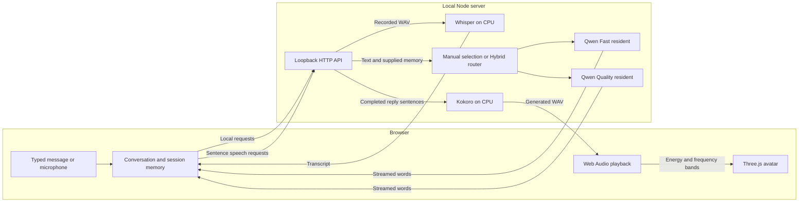

# Milo — a local voice companion in 3D

A Three.js character that speaks preset or custom sentences and has back-and-forth conversations using **local models**. Kokoro speaks, Whisper transcribes your voice, and Qwen writes Milo's replies. CPU mode is the default; compatible GPUs can optionally accelerate replies. No GPU, API key, paid inference service, or browser speech-synthesis service is required. A microphone is optional; you can type conversation messages instead.

Milo combines a textured, expressive robot with streamed speech, interruptible conversation, session memory, and a Hybrid mode that chooses a small or stronger language model for each turn. The models run in the local Node application. The browser displays the avatar, captures microphone audio when requested, and plays the generated voice.


## Contents

- [Quick start](#quick-start)
- [Requirements and model downloads](#requirements-and-model-downloads)
- [What you can do](#what-you-can-do)
- [Have a conversation](#have-a-conversation)
- [Hybrid routing](#hybrid-quick-conversation-more-thought-when-needed)
- [Optional GPU acceleration](#optional-gpu-acceleration)
- [Platform support](#platform-support)
- [Architecture and source layout](#architecture)
- [Development and configuration](#development-and-configuration)
- [Verification and measured performance](#verification-and-measured-performance)
- [Privacy and offline use](#privacy-and-offline-use)
- [Troubleshooting](#troubleshooting)
- [Current limitations](#current-limitations)
- [Sources and licenses](#sources-and-licenses)

## Quick start

Use **Node.js 24 LTS**; the verified version is **24.19.0**. Git is needed for the clone command, or you can download the repository as a ZIP.

```powershell
git clone https://github.com/michaelegbo/milo.git
cd milo
npm install
npm run dev
```

Open [http://127.0.0.1:5173](http://127.0.0.1:5173), choose a sentence, and click **Let Milo speak**. `npm run dev` starts both Vite and the local inference server. Keep that terminal running; press **Ctrl+C** to stop both.

1. Wait for **Kokoro voice · CPU ready**, then try a preset sentence.
2. Open **Conversation** to prepare Whisper and the default Fast reply model.
3. Type a message, or press **Start conversation** and allow microphone access.
4. Choose **Hybrid** to enable automatic per-turn model selection. This prepares the larger model on first use.
5. If a compatible GPU is detected, turn on **GPU acceleration** and wait for readiness. You can switch it off at any time.

The first preparation needs internet access and can take several minutes. A downloaded model is cached; later starts reuse it. Neither opening the page nor GPU detection requests microphone permission.

## Requirements and model downloads

| Requirement | Details |
| --- | --- |
| Runtime | Node.js 24 LTS and npm. Native inference packages must support the host operating system and architecture; see the [platform matrix](#platform-support). |
| Browser | A current browser with WebGL, Web Audio, AudioWorklet, and microphone support. Desktop Google Chrome was used for verification and is the browser selected by the automated tests. |
| CPU | CPU inference is the default. Qwen uses at most six CPU threads; a GPU is optional. There is no validated minimum CPU specification or promised response time. |
| RAM | No universal minimum has been established. The two chat model/context estimates are about **1.42 GiB** for Fast and **3.50 GiB** for Quality, before other runtime overhead. Kokoro, Whisper, the browser, and the operating system need additional memory. |
| Disk | All four model caches occupy roughly **3.8 GB**, plus dependencies, builds, configuration files, and temporary download space. Model weights are downloaded separately and are not committed to the repository. |
| Initial connectivity | Required for npm dependencies and the selected models' first downloads. Complete model caches support subsequent offline inference. |
| Optional input | A microphone for voice turns; typed conversation works without one. Headphones help prevent speaker audio from triggering interruption detection. |
| Optional acceleration | A compatible GPU, existing graphics driver/runtime, and a supported app-local `node-llama-cpp` binary. The switch does not install drivers or toolkits. |

For admission decisions, Milo budgets **2 GiB** for a missing Fast resident, **4.5 GiB** for a missing Quality resident, and a further **2 GiB reserve**. These are conservative scheduling budgets, not measured minimum hardware requirements or exact process sizes. Hybrid checks current free physical memory and, on Windows, commit headroom before keeping both models loaded. If it cannot establish sufficient headroom, it loads models as needed. Having enough disk space for weights does not imply enough RAM to run them together.

The first launch downloads Kokoro and shows **CPU ready** after warm-up. Opening **Conversation** prepares Whisper and Fast. Selecting **Better answers** or **Hybrid** downloads Quality when it is not cached. Download progress appears in the panel; the first preparation can take several minutes.

Model caches live outside `node_modules`, so a dependency reinstall preserves them:

| Model | Purpose | Approximate download | Persistent cache |
| --- | --- | ---: | --- |
| Kokoro 82M ONNX, q8 | Text-to-speech | 92 MB + small configuration files | `server/.cache/models` |
| Whisper base.en ONNX, q8 | English speech-to-text | 79 MB | `server/.cache/stt` |
| Qwen2.5-1.5B-Instruct GGUF, Q4_K_M | Fast conversation replies | 1.12 GB | `server/.cache/chat` |
| Qwen3-4B GGUF, Q4_K_M | Better answers, deeper Hybrid replies and Hybrid summaries | 2.50 GB | `server/.cache/chat` |

Download sizes above use decimal MB/GB; memory budgets use binary GiB. The exact GGUF sizes are **1,117,320,736 bytes** and **2,497,280,256 bytes**. Their upstream revisions and SHA-256 values are pinned in [`server/chat-config.mjs`](server/chat-config.mjs), and each cached or downloaded file is verified before loading.

The included voices and fonts are installed with the app. Subsequent use works offline when all required model files are cached. CPU and GPU execution share these same GGUF files; switching devices does not download another model. Hybrid adds no third language model.

## What you can do

- Pick one of three predefined sentences or enter your own text, up to 600 characters.
- Choose Michael, Heart, or Emma and adjust speaking pace.
- Play, pause, resume, stop, and download the generated WAV.
- Rotate the 3D character, reset the camera, and toggle idle motion.
- Enable **Gestures** for articulated hand movements, elbow bends, wrist turns, small body leans, and nods that follow audible speech. Idle motion is controlled separately.
- See Milo lean in while listening, acknowledge your voice, glance aside while thinking, and return its attention before speaking.
- Notice curved LED smiles, asymmetric curious brows, warmer cheeks, and chest/antenna lights that reflect the actual conversation state.
- Inspect ceramic grain, textured orange coating, rubber joints, brushed metal hardware, and a polished face lens under studio lighting.
- Keep your text, voice, pace, and motion choices across reloads.
- Switch to **Conversation** for spoken or typed messages, local replies, and Milo's animated voice.
- Watch replies arrive progressively, with completed sentences spoken while the rest of a longer reply is generated.
- Choose **Fast**, **Better answers**, or **Hybrid** under **Milo’s mind**. Hybrid automatically chooses between the two local models for each reply.
- Turn **GPU acceleration** on or off. Milo detects compatible hardware, keeps the same model files, and preserves your conversation when switching.
- Inspect explicit personal details and the rolling earlier-conversation summary under **What Milo remembers**.

Mouth opening follows the real audio waveform and closes in silence. Frequency bands add approximate round, wide, and narrow mouth shapes; this is **not phoneme-accurate lip sync**. Microphone input never drives Milo's mouth. Talking gestures use smoothed audio energy and phrase-length envelopes, settling on pause, stop, and silence. Small wording cues in Milo's own spoken text adjust its facial delivery and gesture strength: explicit encouragement looks encouraging, a question looks curious, uncertainty looks thoughtful, and other sentences look warm. These transparent rules do not recognize or infer the user's emotions.

**Idle** controls ambient breathing, blinking, and light variation. **Gestures** controls speaking gestures and the listening lean/nod independently. Reduced motion keeps static expressions and audio-driven mouth movement while suppressing body movement, blinking, moving gaze, and light pulses. The camera remains under your control. The avatar is an original procedural robot, not a likeness of a specific person.

## Have a conversation

| Milo's mind | GPU acceleration off | GPU acceleration on |
| --- | --- | --- |
| **Fast** | Qwen2.5 1.5B on CPU | The same Fast model on GPU |
| **Better answers** | Qwen3 4B on CPU | The same Quality model on GPU |
| **Hybrid** | Routes each turn to Fast or Quality on CPU | Keeps Fast on CPU and Quality on GPU when memory permits; routes each turn between them |

Whisper listening and Kokoro speaking remain on CPU in every mode. The avatar's browser WebGL rendering is independent of this switch. A smaller model is often quicker but less reliable; selecting a stronger model does not give Milo internet access or tools.

1. Select **Conversation** and let the models finish preparing. Press **Start conversation**, then allow microphone access when your browser asks. Loading the page does not request microphone permission.
2. Speak when Milo is listening. After you pause for approximately 0.9 seconds, your turn sends automatically. Use **Send voice message** to finish the recording yourself.
3. The microphone switches off while Whisper transcribes and Qwen begins a reply. Text arrives progressively; completed sentences go to Kokoro separately, so longer replies can start speaking sooner. CPU generation can still leave pauses between sentences. Milo's mouth and gestures follow actual playback.
4. **Interrupt Milo by speaking** monitors your microphone during replies in a voice conversation. A sustained voice onset stops Milo and keeps the same recording, including a short pre-roll to preserve your opening words. Use headphones to reduce speaker echo, or switch this option off and use **Interrupt & talk**. Typed messages never arm microphone monitoring on their own.
5. Enable **Keep listening after each reply** to listen again after each spoken turn, or leave it off and start the next voice turn yourself.
6. Press the square **End conversation** button to stop the conversation and release the microphone. You can also use the message field to type and send a message without recording audio, including when microphone permission is blocked.

Each recording is limited to 20 seconds. At least 0.3 seconds of audible speech is needed; after 10 seconds without speech the recorder stops with a retry message. Headphones and a quiet room help transcription. The current Whisper model is intended for English.

### Microphone controls

Use **Microphone input** to select a device, or leave **System default** selected. The refresh button updates the list without starting a recording; device names may appear only after browser permission is granted. The input meter responds during **Listening** and **Listening for interruption**. **Mic idle** and **Mic paused** mean no capture is running.

**Mute mic** immediately releases the microphone and discards an unfinished recording. It also prevents listening from restarting after a reply; a reply already being generated or spoken can finish. **Unmute mic** enables voice input without recording automatically. Press **Start conversation** or **Unmute & talk** to record. Typed chat remains available while muted. Changing or disconnecting the selected device during capture ends that recording so you can choose an input and start again.

Conversation context is kept in memory for this page session; transcripts are not saved to browser storage or written to disk by the backend. Reloading or **New chat** clears it. Up to eleven recent messages accompany each reply, alongside a short summary of older turns. Compaction preserves six recent messages verbatim and immediately saves labelled excerpts of older turns, then refines them in the background. Opening the next microphone turn does not cancel that summary; a new reply can interrupt it while retaining the excerpt checkpoint. Explicit statements of your name, favourite colour, location, work and learning topic are retained separately, with later corrections taking precedence. The memory panel shows what is supplied to the model. Memory is bounded and can omit details. These models can still misinterpret context or invent answers; memory is not a guarantee of accuracy. They have no internet access or tools for taking actions.

In local checks, **Better answers** handled personal corrections and recalled summarized details more reliably. **Fast** sometimes confused the user's identity with Milo's or omitted an older fact. Choose the 4B option for more demanding conversations; its summaries and longer-context replies can take tens of seconds on CPU.

### Hybrid: quick conversation, more thought when needed

Select **Hybrid · Adapts to you** to keep one conversation while Milo chooses a model for each turn. Greetings and straightforward chat use Fast. Requests for deeper reasoning, comparisons, plans, code, calculations or personal-memory recall use the stronger model. Follow-up questions take the recent conversation into account.

The **Quick reply** or **Thinking deeper** indicator explains the choice before the answer arrives; it becomes **Considered reply** when a stronger-model response is spoken. Both routes share the same supplied history and memory, use Kokoro, support streaming and voice interruption, and stay on this computer. Hybrid chooses the answering model before speaking substantive content.

Routing uses lightweight rules rather than an additional model call. It is a practical heuristic, not a guarantee that Milo has measured a question's difficulty correctly. You can choose Fast or Better answers directly to override it.

In CPU mode, when available memory permits, Hybrid keeps both models ready and runs only one chat/summary inference at a time. This avoids reloading weights every time a conversation moves between simple and complex questions. On lower-memory machines it keeps one model resident and loads the required model as needed; the interface explains this tradeoff. Preparing both models can take longer initially. Hybrid uses the existing caches and needs no third model download.

### Optional GPU acceleration

Use **GPU acceleration** below **Milo’s mind** to accelerate conversation replies and memory summaries. The switch shows the detected adapter and the actual execution state. Kokoro speech and Whisper listening remain on CPU; the avatar keeps using WebGL independently.

The bridge uses GPU binaries already installed with Milo and the existing graphics driver. It does not install a system service, change drivers or global settings, download a toolkit, compile software, or download another copy of the model. On supported CPU hosts, hardware without a compatible GPU runtime keeps working on CPU. GPU acceleration starts off after a server restart.

This applies to GPU detection and switching at runtime. Initial `npm install` still installs the project's Node dependencies and can run their installation scripts, including native runtime package setup. Milo is a local application with dependencies, not a browser-only or zero-install inference engine.

Turning the switch off is available during GPU loading or a reply. Switching stops the current turn and releases its microphone/audio activity, waits for the GPU process to exit, then reloads the same selected mode on CPU. Your transcript, explicit details and summary remain in the tab. The interrupted turn is not resumed automatically. The transition takes time to release and load models; watch for the ready state before sending the next message. Other open Milo tabs follow the shared execution change.

On the verified Windows RTX 4090 setup, Milo uses **Vulkan**. Accelerated Hybrid keeps Fast ready on CPU and Quality ready on GPU when memory permits. Simple turns use the small CPU model; deeper replies and summaries use the stronger GPU model. Both can remain loaded, avoiding reload delays between routes while using just one GPU model context. If available RAM is too low, Milo loads the required model on demand and explains that in its status. Choosing Fast or Better answers directly runs that selected model on GPU.

GPU load or inference failures return to CPU with a visible message; retry the interrupted turn after CPU readiness. A process that cannot be confirmed stopped blocks replacement loading and asks you to restart Milo.

Compatible Windows drivers generally supply Vulkan; see the runtime's [Vulkan support and context limitations](https://node-llama-cpp.withcat.ai/guide/Vulkan). CUDA may be used when an already-installed compatible runtime is available. Milo never installs it automatically.

**Kokoro itself provides text-to-speech (TTS), not speech-to-text (STT).** Whisper supplies STT in Conversation, and Qwen supplies the generated responses.

## Platform support

The application has been exercised end to end on Windows. Runtime capabilities listed by an underlying library are broader than the combinations verified in Milo.

| Platform | Current status |
| --- | --- |
| **Windows, CPU** | Verified for speech, English transcription, both reply models, Hybrid, streaming, memory, and cancellation. |
| **Windows, NVIDIA RTX 4090, Vulkan** | Verified GPU detection, positive layer offloading, mixed CPU/GPU Hybrid handoffs, switching off during generation, process exit, and CPU recovery. The tested adapter has 24 GB VRAM. |
| **Other Windows GPUs / CUDA** | Detection considers compatible installed CUDA and Vulkan runtimes. Specific AMD, Intel, other NVIDIA, and CUDA execution combinations have not been verified end to end; detection alone is not proof of model execution. |
| **Linux** | CPU and GPU runtime paths exist in the dependencies, but installation, audio, device switching, and recovery have not been verified for Milo on Linux. |
| **macOS, Apple Silicon** | The detector can probe Metal, but Milo's explicit CPU startup/OFF path currently requires a separate CPU binary. That path needs adaptation and testing on Apple Silicon. End-to-end support is **not established**. |
| **macOS, Intel** | End-to-end operation and GPU acceleration are unverified; compatible GPU execution has not been established. |
| **iOS / Android browsers** | The responsive layout is browser UI only. Milo does not run its Node/native inference backend or models directly in a mobile browser. WebGPU inference is not implemented. |

GPU inference always uses the computer running Milo's **Node server**, not the GPU of a remote browser or phone. The supplied app binds to `127.0.0.1`, with no LAN access, remote authentication, or HTTPS deployment configured. A mobile-size screenshot demonstrates layout behavior; it is not evidence of a phone running the models. Browser microphone access from a separately hosted client would also need an appropriate secure origin and a deliberately configured backend.

## Architecture



CPU reply residents run in workers. A GPU resident runs in a separate process; accelerated Hybrid keeps only one GPU model context. Warm-ups, replies, and memory summaries share a serialized chat queue. The speech and transcription engines have their own bounded queues and runtime isolation.

| Component | Implementation |
| --- | --- |
| Avatar | Three.js, procedural geometry and physical surface finishes, OrbitControls, generated reflection environment, studio lights and shadows |
| Speech | Kokoro 82M ONNX, `kokoro-js`, q8 quantization, explicit CPU provider |
| Listening | Web Audio AudioWorklet capture, silence detection, 16 kHz mono PCM WAV; Whisper base.en ONNX through Transformers.js, q8 on CPU |
| Replies | Qwen2.5-1.5B or Qwen3-4B GGUF Q4_K_M through `node-llama-cpp`; CPU by default, optional GPU subprocess, Hybrid routing, streamed text, sentence speech queue, recent history plus explicit facts and rolling summary |
| Audio / animation | Web Audio playback, analyser energy/frequency bands, bounded expression and gesture controllers |
| Local API | Node HTTP on `127.0.0.1:8787`, accessed through Vite's `/api` proxy |
| UI | TypeScript and CSS, local variable fonts, responsive controls |

The speech API serializes CPU inference, bounds the queue, caches repeated speech, limits request sizes, rejects unsupported options, and checks that phonemized inputs fit the model instead of silently truncating. Exceptionally dense numeric or acronym text may require a shorter sentence. Cancelling playback immediately stops audio; a speech generation already running on the CPU finishes and may be cached. Listening runs in a separate Node process, CPU replies use workers, and GPU replies use a separate process, keeping the native runtimes isolated and the HTTP server responsive. Conversation requests have bounded audio, message sizes, and concurrent work.

### Source layout

```text
src/
  main.ts                    Studio shell, tabs, preferences and integration
  avatar.ts                  Procedural Three.js character, camera and lighting
  materials.ts               Generated surface textures and material finishes
  avatar-expression.ts       Eye, brow, mouth and light expressions
  talking-motion.ts          Bounded hand, arm and body movement
  utterance-mood.ts           Rules for delivery cues in Milo's outgoing words
  speech.ts                  Streaming speech queue, playback and WAV download
  microphone.ts              Capture lifecycle, silence and interruption detection
  conversation.ts            Conversation controls and CPU/GPU state
  conversation-memory.ts     Explicit facts and streamed reply parsing
  style.css                  Responsive interface and reduced-motion styling
public/
  audio-recorder.worklet.js   Browser audio capture processor
server/
  index.mjs                  Loopback API, validation and request cancellation
  engine.mjs                 Kokoro CPU speech engine and audio cache
  stt-engine.mjs              Whisper process management
  stt-worker.mjs              Whisper CPU inference process
  chat-engine.mjs            Model residency, routing and shared inference queue
  chat-router.mjs            Deterministic Hybrid routing rules
  chat-memory-budget.mjs     Physical RAM / Windows commit admission
  chat-acceleration.mjs      Device switching and CPU recovery
  chat-gpu-detection.mjs     Bounded, local GPU runtime detection
  chat-gpu-probe.mjs         Isolated driver/runtime probe
  chat-single-engine.mjs     Per-model lifecycle and cancellation
  chat-worker-transport.mjs  Worker/process transport
  chat-worker.mjs            Qwen context and actual CPU/GPU generation
  chat-config.mjs            Model pins, prompts and validation limits
  chat-model-cache.mjs       Downloads and GGUF integrity checks
  chat-reply-stream.mjs      Bounded, sentence-aware incremental output
  *.test.mjs                 Deterministic backend tests
  verify*.mjs                Real inference verification scripts
tests/                       Browser, audio, motion and conversation checks
scripts/dev.mjs              Starts/stops the local server and Vite together
docs/DESIGN.md               Character and interaction design decisions
VERIFICATION.md             Recorded checks, timings and practical boundaries
```

See [`server/README.md`](server/README.md) for request/response contracts, queue limits, status fields, and the speech API. The core endpoints are `/api/speech`, `/api/transcribe`, `/api/chat/stream`, `/api/chat/summary`, and `/api/conversation/{health,prepare,acceleration}`.

## Development and configuration

The app uses TypeScript, Vite, Three.js, `kokoro-js`, Transformers.js, and `node-llama-cpp`. Dependency versions are pinned in `package.json` and `package-lock.json`. Use `npm ci` when you want to install exactly the lockfile from a clean checkout.

| Command | Purpose |
| --- | --- |
| `npm run dev` | Start the frontend on port 5173 and inference server on port 8787 together. |
| `npm run dev:web` | Start only Vite; an inference server must already be running. |
| `npm run dev:speech` | Start only the local speech and conversation API. |
| `npm run build` | Run TypeScript checks, then build the frontend into `dist`. |
| `npm run preview` | Serve the built frontend locally on port 5173, with the same API proxy. |
| `npm test` | Run deterministic backend tests, then Playwright app/browser tests against the running app. |

For a local production-frontend check, run `npm run build`, then run `npm run dev:speech` and `npm run preview` in separate terminals. The inference server must remain running: **the `dist` folder alone cannot run the speech or conversation models**. This repository does not include a hosted service or a production deployment setup.

### Environment variables

No API key or `.env` file is required. The server reads process environment variables directly; the development launcher passes them to its children.

| Variable | Default / use |
| --- | --- |
| `SPEECH_PORT` | `8787`. Changes the local API port. If changed, update the API proxy in `vite.config.js` as well; this is not automatic. |
| `SPEECH_OFFLINE` | Set to `1` to require the existing Kokoro cache and reject missing files instead of downloading. |
| `STT_OFFLINE` | Set to `1` to require the existing Whisper cache. |
| `CHAT_OFFLINE` | Set to `1` to require the existing pinned GGUF cache. |
| `SPEECH_URL` | Base URL for the running-server verifiers that accept it; defaults to `http://127.0.0.1:8787`. It does not configure the frontend proxy. |
| `CHAT_VERIFY_PROFILES` | `fast,quality`. Used by `verify-chat.mjs`; set to `fast` to check only the smaller model. |

For example, after downloading the models you intend to use, start a cache-only PowerShell session with:

```powershell
$env:SPEECH_OFFLINE = '1'
$env:STT_OFFLINE = '1'
$env:CHAT_OFFLINE = '1'
npm run dev
```

These flags affect that shell and its child processes. They do not download missing caches or install a system setting. Start a new terminal without the flags to permit initial model downloads again. CPU/GPU selection is controlled through the app switch and resets to CPU when the server restarts.

## Verification and measured performance

The recorded validation run on **9 September 2026** passed the production build, TypeScript checks, **31 deterministic backend tests**, and **58 app/browser tests**. These are results from that run, not a claim that every operating system, GPU, or microphone has been tested. See [`VERIFICATION.md`](VERIFICATION.md) for the evidence, samples, and known boundaries.

With the app running and **GPU acceleration off**, check the build, app/browser flows, real CPU speech, and CPU Hybrid behavior:

```powershell
npm run build
npm test
node server/verify.mjs
node server/verify-hybrid.mjs
```

The speech check creates `server/verification/cpu-speech.wav`, which the later STT check requires. With a detected compatible GPU and the app still running, exercise the optional acceleration path:

```powershell
node server/verify-acceleration.mjs
```

The following checks create their own native engines rather than using the running server. After caching the required models and creating the speech fixture, stop the development server first on a memory-constrained machine, then run these sequentially:

```powershell
node server/verify-offline.mjs
node server/verify-stt.mjs
node server/verify-chat.mjs
```

| Check | Runtime / side effects |
| --- | --- |
| `npm test` | Backend unit tests, then app/browser tests against the running frontend/API. Browser flows can change the selected profile. |
| `verify.mjs` | Running API; generates a CPU speech fixture and verifies audio/validation/cache behavior. |
| `verify-hybrid.mjs` | Running API; checks CPU Hybrid handoffs and leaves Hybrid selected. Start with acceleration off. |
| `verify-acceleration.mjs` | Running API and compatible GPU; switches execution devices, tests recovery, and leaves acceleration off. |
| `verify-offline.mjs` | Isolated Kokoro engine with external fetch blocked; requires a complete speech cache. |
| `verify-stt.mjs` | Isolated Whisper engine/process checks; needs the speech fixture, then verifies cached offline transcription. |
| `verify-chat.mjs` | Independent chat engines; checks Fast and Quality by default and can download missing selected models unless `CHAT_OFFLINE=1`. |

Google Chrome must be installed for the configured Playwright browser tests. They use generated fixtures and real Web Audio paths; they do not require permission to record your physical microphone. Real-model verifiers can allocate extra contexts and compete for CPU, RAM, or VRAM, so avoid running them simultaneously.

`npm test` first runs deterministic Hybrid routing, memory-admission and worker-lifecycle checks, then browser tests using installed Google Chrome. They cover real speech reaching the audio graph, playback completion, pause/resume, download, mobile custom text, reload persistence (including gesture preferences), cancellation, error recovery, keyboard navigation, reduced motion, and reconnection. Hybrid browser tests verify stable mode selection, visible routes, shared context, stream recovery and cancellation. Motion tests cover silence, alternating hands, settling, disabled gestures, and safe joint ranges across irregular frames. The offline check blocks external fetches and generates a real clip from the persistent model cache. The Hybrid verifier uses the running server to check actual per-turn model handoffs and leaves Hybrid selected.

The STT check transcribes a generated speech fixture, verifies invalid and silent input rejection, checks cancellation and concurrent-request handling, and repeats transcription from the cache in offline mode. Run the speech check first so its fixture exists. The chat check exercises the real CPU reply model. Microphone capture, WAV encoding, silence detection, cancellation races, and resource cleanup have been checked with synthetic audio. **A real physical microphone conversation has not yet been manually verified.**

The GPU checks cover hardware detection, unavailable devices, switching during streams and audio playback, rapid ON/OFF requests, shared-tab changes, CPU recovery, and mixed CPU/GPU Hybrid residency. `verify-acceleration.mjs` requires a detected compatible GPU and compares real CPU/GPU replies from the same cached Quality model, checks Hybrid handoffs, then switches off during a GPU reply and verifies CPU recovery. It records timings in `server/verification/acceleration-report.json` and leaves acceleration off.

### One measured CPU/GPU comparison

On the verified **Windows / NVIDIA RTX 4090 24 GB / Vulkan** host, the same Qwen3 4B model, prompt, and supplied memory produced an identical 128-character answer on both devices:

| Execution | First streamed text | Complete model reply |
| --- | ---: | ---: |
| CPU | 8.833 s | 13.773 s |
| RTX 4090 / Vulkan | 0.130 s | 0.326 s |

These are **single measured samples**, excluding initial model loading, speech-to-text, text-to-speech, and audio playback. They are not end-to-end conversation timings or a general performance guarantee. GPU preparation took **7.842 s** separately. The test confirmed 37 Quality-model layers offloaded, successful mixed Hybrid handoffs without reloading either resident, and CPU recovery after switching off during generation.

Generated verification WAV/JSON files are written under `server/verification/` when the scripts run; they are not repository assets. The model caches and test output directories are excluded from source delivery. The build currently reports a Three.js chunk size advisory of about 574 kB before gzip / 143 kB gzipped; the build itself passes.

## Privacy and offline use

- **Inference stays local.** Audio, transcripts, and messages go to the loopback Node server. Milo does not send them to a remote inference API and has no internet-search or action tools.
- **Microphone access is explicit.** Capture starts after a voice action and browser permission. Typed conversation does not activate it. Mute, End, mode changes, device changes during capture, and page exit release the relevant tracks.
- **Conversation memory is temporary.** History, explicit facts, and the rolling summary live in the current tab and are supplied with each request. New chat or reload clears them. The backend does not write submitted messages or microphone audio to disk.
- **Studio preferences persist separately.** The custom sentence, voice, pace, and motion choices use browser local storage. Clear the custom text or site data to remove them. Downloading a generated WAV intentionally saves an audio file to your chosen download location.
- **Model caches persist.** Cached weights and configuration are files on disk, outside `node_modules`; they are not transcript storage. Speech reuse also has a bounded in-memory cache.
- **Initial setup makes network requests.** npm installs dependencies, and first model use downloads weights from their upstream hosts. Complete caches allow subsequent local inference without internet. Cache-only environment flags make missing models fail clearly.

The server accepts local browser origins and binds to loopback. It is a local application, not an authenticated multi-user server. Do not interpret a public GitHub repository as a running remote Milo service.

## Troubleshooting

- **Voice offline:** start `npm run dev`; the local API needs to be running on port 8787.
- **Model cannot load:** connect to the internet for the initial downloads, allow enough free disk space, and try again. Preserve the three model cache folders afterward.
- **Port already in use:** stop the existing Milo terminal before starting another copy. Ports 5173 and 8787 must be available for the supplied configuration.
- **No 3D preview:** use a browser with WebGL enabled. Hardware acceleration is recommended for the avatar rendering; the speech engine still uses only the CPU.
- **No sound:** check your device volume and browser sound permissions, then press Speak again.
- **Microphone blocked or unavailable:** allow microphone access for `127.0.0.1`, check that an input device is connected, and retry Start. Typed conversation remains available.
- **No speech heard / incorrect transcription:** speak closer to the microphone, reduce background noise, use English, and keep each turn under 20 seconds.
- **Slow replies:** wait for preparation to finish, try GPU acceleration when available, or close CPU-heavy apps. Listening and speech still use CPU, so faster reply generation does not eliminate every delay.
- **GPU unavailable:** CPU mode remains usable on supported CPU hosts. The bridge requires a compatible runtime and driver already present; it does not install drivers or toolkits. Restart Milo to run detection again, and check the platform matrix if the CPU runtime also fails to load.
- **GPU switch is on but quick replies use CPU:** this is expected in accelerated Hybrid. The small Fast model stays on CPU while the stronger Quality model stays ready on GPU. Choose Fast or Better answers directly if you want that selected model to use the GPU.
- **Switching takes time:** the current reply is stopped, the old model runtime must exit, and the selected mode is prepared on the new device. Wait for readiness and resend the interrupted turn. History and memory remain in the tab.
- **Runtime did not stop / replacement blocked:** restart Milo. The bridge deliberately waits for confirmed process exit before loading a replacement GPU context.
- **A phone cannot connect to `127.0.0.1:5173`:** that address refers to the phone itself. Milo's supplied server is local to the host computer; a LAN/mobile connection and browser inference are not configured.
- **Playwright cannot find Chrome:** install Google Chrome for the configured test channel, or deliberately adapt `playwright.config.ts` to an available browser and reverify it.

## Current limitations

- The robot is procedural and expressive, but its mouth follows audio energy/frequency bands rather than phoneme timings. It is not a photorealistic human or phoneme-accurate lip-sync system.
- Whisper input is English-only. Voice output uses the three included Kokoro voices; voice cloning and custom speaker training are not implemented.
- Replies are intentionally short: normally one to three spoken sentences, bounded to 600 characters. Quality mode is a stronger answer model, not an unrestricted deep-research or long-form reasoning workflow.
- Hybrid routing is deterministic and can choose imperfectly. Both models can invent facts or misremember details; explicit facts and summaries improve continuity without guaranteeing accuracy.
- Memory belongs to one tab session. There is no durable account history, cross-device synchronization, database, retrieval knowledge base, browsing, or external action tools.
- Physical microphone and room-acoustics behavior still needs manual testing. Synthetic audio validates capture mechanics, but speaker echo, microphones, drivers, and noise vary.
- GPU acceleration applies to chat and summaries. STT and TTS remain CPU-based, and accelerated Hybrid intentionally keeps Fast replies on CPU. GPU availability and speed depend on the host runtime and hardware.
- Cross-platform runtime support remains as stated in the [platform matrix](#platform-support). Mobile WebGPU inference, a native mobile backend, LAN access, and hosted deployment are possible future work; none is built into this version.

## Sources and licenses

- [Three.js](https://threejs.org/) — MIT.
- [Kokoro and Kokoro JS](https://github.com/hexgrad/kokoro/tree/main/kokoro.js) — Apache-2.0.
- [Kokoro ONNX weights](https://huggingface.co/onnx-community/Kokoro-82M-v1.0-ONNX) — Apache-2.0.
- [Whisper base.en ONNX weights](https://huggingface.co/Xenova/whisper-base.en) — model repository lists Apache-2.0.
- [Qwen2.5-1.5B-Instruct GGUF weights](https://huggingface.co/Qwen/Qwen2.5-1.5B-Instruct-GGUF) — Apache-2.0.
- [Qwen3-4B GGUF weights](https://huggingface.co/Qwen/Qwen3-4B-GGUF) — Apache-2.0.
- [node-llama-cpp](https://github.com/withcatai/node-llama-cpp) — local llama.cpp integration for the reply model.
- [Transformers.js](https://github.com/huggingface/transformers.js) — Apache-2.0; ONNX model loading and inference integration.
- Local DM Sans and Manrope fonts — SIL Open Font License, included in their Fontsource packages.

Dependencies and model weights retain their own licenses. The bundled phonemizer uses eSpeak NG components; review those dependency terms before redistributing a packaged binary. See [`server/README.md`](server/README.md) for source links and API details, and [`docs/DESIGN.md`](docs/DESIGN.md) for the design rationale.
